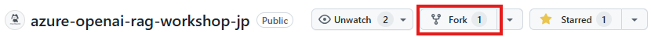
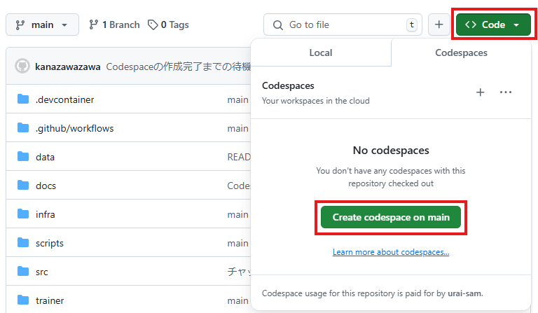
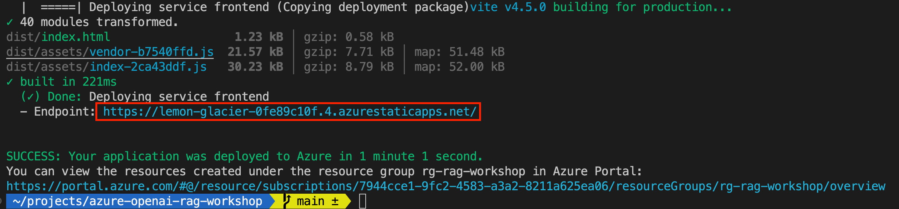

# ワークショップ デプロイ最短ルート

## 前提条件

<div data-hidden="$$proxy$$">

| | |
|----------------------|------------------------------------------------------|
| GitHubアカウント       | [無料のGitHubアカウントを取得](https://github.com/join) |
| GitHub Codespaces     | [無料のCodespaces](https://github.co.jp/features/codespaces) |
| Azureアカウント        | [無料のAzureアカウントを取得](https://azure.microsoft.com/free) |
| Azure OpenAI APIへのアクセス | [Azure OpenAIへのアクセスをリクエスト](https://aka.ms/oaiapply) |
| Webブラウザ        | [Microsoft Edgeを取得](https://www.microsoft.com/edge) |
</div>


[GitHub Codespaces](https://github.com/features/codespaces)を使用して、このワークショップのために準備されたインスタント開発環境を利用します。


<div class="info" data-title="note" data-hidden="$$proxy$$">

> Azureアカウントには、`Microsoft.Authorization/roleAssignments/write`権限が必要です。例えば、[ロールベースアクセス制御管理者(Role Based Access Control Administrator)](https://learn.microsoft.com/azure/role-based-access-control/built-in-roles#role-based-access-control-administrator-preview)、[ユーザーアクセス管理者(User Access Administrator)](https://learn.microsoft.com/azure/role-based-access-control/built-in-roles#user-access-administrator)、または[所有者(Owner)](https://learn.microsoft.com/azure/role-based-access-control/built-in-roles#owner)などです。また、Azureリソースのデプロイを許可するために、サブスクリプションレベルで`Microsoft.Resources/deployments/write`権限も必要です。
>
> 個人のAzureサブスクリプションを使用している場合は問題ありません。会社から提供されたAzureサブスクリプションを使用している場合は、必要な権限があることを確認するためにIT部門に連絡する必要があるかもしれません。  
> 
> ※動作確認済み権限：サブスクリプションレベルで共同作成者とユーザーアクセス管理者ロールを付与
</div>

---


## 準備
1. [このGitHubリポジトリ](https://github.com/kanazawazawa/azure-openai-rag-workshop-jp/)を開きます。  
  
2. **Fork**ボタンをクリックし、**Create fork**をクリックして、プロジェクトのコピーを自分のGitHubアカウントに作成します。



フォークが作成されたら、**Code**ボタンを選択し、**Codespaces**タブをクリックして**Create Codespaces on main**をクリックします。




Codespace の作成が完了するまでブラウザを開いたまま10分ほどお待ちください。  


Codespace の作成完了後、テンプレートのセットアップを完了するには、プロジェクトのルートで以下のコマンドをターミナル(Codespace上のターミナル bash)で実行してください：

```bash
chmod +x ./scripts/setup-template.sh
```
```bash
./scripts/setup-template.sh aisearch
```


## Azureのセットアップ
#### Azureにログイン

まず、次のコマンドを使用してAzureサブスクリプションにログインします：

```sh
azd auth login --use-device-code
```

複数のディレクトリに属していて、エラーが発生した場合は、tenant-id に利用される Domain 名を指定し再度実行してください。

```sh
azd auth login --tenant-id <xxxxxxx>.onmicrosoft.com --use-device-code 
```

#### 新しい環境を作成

次に、新しい環境を設定します。Azure Developer CLIは、設定とリソースを管理するために環境を使用します（リソースグループ名に使用されるため、同サブスクリプションで複数人が実施する場合、一意になるよう修正します）：

```sh
azd env new openai-rag-workshop-<yourname>
```


#### Azureインフラストラクチャのデプロイ

次に、ワークショップのAzureインフラストラクチャをデプロイします。次のコマンドを実行します：
```sh
azd provision
```
Azureサブスクリプションとデプロイメントリージョンを選択するように求められます。一般的には、ユーザーベースに最も近いリージョンを選択するのが最適ですが、このワークショップでは`West Europe`または`East US 2`のいずれかを選択してください。

インフラストラクチャがデプロイされた後、次のコマンドを実行します：

```bash
azd env get-values > .env

# Dockerでサポートされていないため、すべての二重引用符を削除します
perl -pi -e 's/\"//g' .env
```

これにより、リポジトリのルートに`.env`ファイルが作成され、Azureサービスに接続するために必要な環境変数が含まれます。

### 取り込みサービスのデプロイ

インフラストラクチャがデプロイされたら、すぐに取り込みサービスをデプロイできます。

```sh
azd deploy ingestion
```
```bash
chmod +x ./scripts/ingest-data.sh
```
```bash
./scripts/ingest-data.sh
```

## チャット API

### SDKクライアントの初期化
ファイル `src/backend/src/plugins/chat.ts` を開きます。  
`// TODO: initialize clients here` を実際のクライアント設定コードに置き換えます。

#### Azure資格情報の管理, LangChain.jsクライアント

資格情報の取得、LangChain.js クライアントの作成、GPTモデルに送信される基本プロンプトの作成    
ファイル `src/backend/src/plugins/chat.ts` の冒頭に下記を追加します。
```ts
import { DefaultAzureCredential, getBearerTokenProvider } from '@azure/identity';
import { AzureChatOpenAI, AzureOpenAIEmbeddings } from '@langchain/openai';
import { AzureAISearchVectorStore } from '@langchain/community/vectorstores/azure_aisearch';

const SYSTEM_MESSAGE_PROMPT = `Assistant helps the Consto Real Estate company customers with support questions regarding terms of service, privacy policy, and questions about support requests. Be brief in your answers.
Answer ONLY with the facts listed in the list of sources below. If there isn't enough information below, say you don't know. Do not generate answers that don't use the sources below. If asking a clarifying question to the user would help, ask the question.
For tabular information return it as an html table. Do not return markdown format. If the question is not in English, answer in the language used in the question.
Each source has a name followed by colon and the actual information, always include the source name for each fact you use in the response. Use square brackets to reference the source, for example: [info1.txt]. Don't combine sources, list each source separately, for example: [info1.txt][info2.pdf].
`;

/*
const SYSTEM_MESSAGE_PROMPT = `アシスタントは、Consto Real Estate社の顧客に対して、利用規約、プライバシーポリシー、およびサポートリクエストに関する質問のサポートを行います。回答は簡潔にしてください。
以下のソースリストに記載されている事実のみを使用して回答してください。以下に十分な情報がない場合は、知らないと言ってください。ソースを使用しない回答を生成しないでください。ユーザーに明確化の質問をすることが役立つ場合は、質問してください。
表形式の情報はHTMLテーブルとして返してください。Markdown形式では返さないでください。質問が英語でない場合は、質問に使用された言語で回答してください。
各ソースには名前があり、その後に実際の情報が続きます。回答に使用する各事実について、必ずソース名を含めてください。ソースを参照するには角括弧を使用してください。例えば：[info1.txt]。ソースを組み合わせず、各ソースを個別にリストしてください。例えば：[info1.txt][info2.pdf]。
`;
*/
```

コメント `// TODO: initialize clients here` を確認します。  
次に、`const config = fastify.config;` 行の下に次のコードを追加します:


```ts
// 現在のユーザーIDを使用して認証します。
// シークレットは不要で、ローカルでは `az login` または `azd auth login` を使用し、Azureにデプロイされた場合はマネージドIDを使用します。
const credentials = new DefaultAzureCredential();

// OpenAIトークンプロバイダーを設定
const getToken = getBearerTokenProvider(credentials, 'https://cognitiveservices.azure.com/.default');
const azureADTokenProvider = async () => {
  try {
    return await getToken();
  } catch {
    // ローカルコンテナ環境ではAzure IDがサポートされていないため、ダミーキーを使用します（OpenAIプロキシを使用する場合のみ機能します）。
    fastify.log.warn('Azure OpenAIトークンの取得に失敗しました。ダミーキーを使用します');
    return '__dummy';
  }
};

// LangChain.jsクライアントを設定
fastify.log.info(`OpenAIを使用しています: ${config.azureOpenAiApiEndpoint}`);

const model = new AzureChatOpenAI({
  azureADTokenProvider,
  // OpenAIエンドポイントを設定可能にするために必要
  azureOpenAIBasePath: `${config.azureOpenAiApiEndpoint}/openai/deployments`,
  // ランダム性を制御します。0 = 決定論的、1 = 最大ランダム性
  temperature: 0.7,
  // 生成するトークンの最大数
  maxTokens: 1024,
  // 生成する完了の数
  n: 1,
});
const embeddings = new AzureOpenAIEmbeddings({
  azureADTokenProvider,
  // OpenAIエンドポイントを設定可能にするために必要
  azureOpenAIBasePath: `${config.azureOpenAiApiEndpoint}/openai/deployments`,
});
const vectorStore = new AzureAISearchVectorStore(embeddings, { credentials });
```

### ChatServiceの作成

すべてのクライアントを作成したので、`ChatService` インスタンスを適切に初期化する時が来ました。`ChatService` コンストラクタ呼び出しのパラメータを次のようにコメント解除します:

```ts
const chatService = new ChatService(config, model, vectorStore);
```

現在の設定、Azure OpenAIチャットモデルクライアント、およびAzure AI Searchベクトルストアクライアントを `ChatService` インスタンスに渡します。

#### ドキュメントの取得、拡張プロンプトの作成、応答の生成

RAGパターンの実装を開始する時が来ました！最初のステップは、ベクトルデータベースからドキュメントを取得することです。`ChatService` クラスには、現在 `// TODO: implement Retrieval Augmented Generation (RAG) here` とコメントされている `run` メソッドがあります。ここでRAGパターンを実装します。

`// TODO: implement Retrieval Augmented Generation (RAG) here` の下に記述  
```ts
// 最後のメッセージの内容（質問）を取得
const query = messages[messages.length - 1].content;

// ベクトル類似性検索を実行
// クエリの埋め込みは自動的に計算されます
const documents = await this.vectorStore.similaritySearch(query, 3);

const results: string[] = [];
for (const document of documents) {
  const source = document.metadata.source;
  const content = document.pageContent.replaceAll(/[\n\r]+/g, ' ');
  results.push(`${source}: ${content}`);
}

const content = results.join('\n');


// システムメッセージでコンテキストを設定
const systemMessage = SYSTEM_MESSAGE_PROMPT;

// 最新のユーザーメッセージ（質問）を取得し、ソースを注入
const userMessage = `${messages[messages.length - 1].content}\n\nSources:\n${content}`;

// メッセージプロンプトを作成
const messageBuilder = new MessageBuilder(systemMessage, this.config.azureOpenAiApiModelName);
messageBuilder.appendMessage('user', userMessage);

// トークン制限を超えない限り、前のメッセージをプロンプトに追加
for (const historyMessage of messages.slice(0, -1).reverse()) {
  if (messageBuilder.tokens > this.tokenLimit) {
    messageBuilder.popMessage();
    break;
  }
  messageBuilder.appendMessage(historyMessage.role, historyMessage.content);
}

// デバッグ目的の処理詳細
const conversation = messageBuilder.messages.map((m) => `${m.role}: ${m.content}`).join('\n\n');
const thoughts = `検索クエリ:\n${query}\n\n会話:\n${conversation}`.replaceAll('\n', '<br>');


const completion = await this.model.invoke(messageBuilder.getMessages());

// Chat仕様形式で応答を返す
return {
  message: {
    content: completion.content as string,
    role: 'assistant',
  },
  context: {
    data_points: results,
    thoughts: thoughts,
  },
};
```


### APIルートの作成

`ChatService` インスタンスができたので、それを呼び出すAPIルートを作成する必要があります。ファイル `src/backend/src/routes/root.ts` を開きます。`// TODO: create /chat endpoint` というコメントが次に何をすべきかのヒントを与えてくれます。

では、`/chat` エンドポイントを作成しましょう:

```ts
fastify.post('/chat', async function (request, reply) {
  const { messages } = request.body as any;
  try {
    return await fastify.chat.run(messages);
  } catch (_error: unknown) {
    const error = _error as Error;
    fastify.log.error(error);
    return reply.internalServerError(error.message);
  }
});
```
## Dockerfileを作成する
### ビルドステージの定義、最終イメージの作成

`src/backend`フォルダーに`Dockerfile`を作成して、APIのDockerイメージをビルドしましょう:

```dockerfile
# syntax=docker/dockerfile:1

# Node.jsアプリをビルド
# ------------------------------------
FROM node:20-alpine as build
WORKDIR /app
COPY ./package*.json ./
COPY ./src/backend ./src/backend
RUN npm ci --cache /tmp/empty-cache
RUN npm run build --workspace=backend

FROM node:20-alpine
ENV NODE_ENV=production

WORKDIR /app
COPY ./package*.json ./
COPY ./src/backend/package.json ./src/backend/
RUN npm ci --omit=dev --workspace=backend --cache /tmp/empty-cache
COPY --from=build app/src/backend/dist src/backend/dist
EXPOSE 3000
CMD [ "npm", "start", "--workspace=backend" ]
```

このセットアップにより、Dockerは最初にアプリをビルドするためのコンテナを作成し、その後、最初のコンテナからコンパイルされたアプリコードをコピーして最終的なDockerイメージを作成します。


## チャットウェブサイト

Chat APIが完成したので、それを使用するウェブサイトを完成させる時が来ました。

### チャットAPIの呼び出し

次に、先ほど作成したチャットAPIを呼び出す必要があります。これには、`src/frontend/src/api.ts`ファイルを編集し、`TODO`コメントがある場所にコードを完成させます:

```ts
// TODO: complete call to Chat API here
// const response =
```

さあ、コードを完成させましょう！🙂

```ts
const response = await fetch(`${apiUrl}/chat`, {
  method: 'POST',
  headers: { 'Content-Type': 'application/json' },
  body: JSON.stringify({
    messages: options.messages,
  }),
});
```

このメソッドは、Webコンポーネントの`onSendClicked`メソッドから呼び出されます。

## Azureへのデプロイ

アプリケーションはAzureにデプロイする準備が整いました！

フロントエンドをデプロイするために[Azure Static Web Apps](https://learn.microsoft.com/azure/static-web-apps/overview)を使用し、バックエンドとインジェクションサービスをデプロイするために[Azure Container Apps](https://learn.microsoft.com/azure/container-apps/overview)を使用します。

プロジェクトのルートからこのコマンドを実行して、アプリケーションをビルドしてデプロイします（このコマンドはプロジェクトルートにある`azure.yaml`ファイルにリストされているすべてのサービスをデプロイします）:

```bash
azd deploy backend
```

```bash
azd deploy frontend
```

このプロセスには数分かかる場合があります。完了すると、コマンドの出力にデプロイされたフロントエンドアプリケーションのURLが表示されます。



このURLをブラウザで開き、デプロイされたアプリケーションをテストできます。


<div class="tip" data-title="ヒント">

> `azd deploy <service_name>`コマンドを実行して、サービスを個別にビルドおよびデプロイすることもできます。これにより、必要に応じてバックエンド、フロントエンド、およびインジェクションサービスを独立してデプロイできます。
>
> さらに良いことに！最初から始めて完成したコードがある場合は、`azd up`コマンドを使用できます。このコマンドは`azd provision`と`azd deploy`の両方を組み合わせて、Azureリソースをプロビジョニングし、1つのコマンドでアプリケーションをデプロイします。

</div>

### Azureリソースのクリーンアップ

<div class="important" data-title="important">

> ワークショップが終了したら、不要なコストを避けるためにAzureリソースを削除することを忘れないでください！

</div>

Azureリソースを削除するには、次のコマンドを実行できます：

```bash
azd down --purge
```

作成したリソースグループを Azure Portal 上から直接削除していただいてもかまいません。
Codespece も不要な場合は、ブラウザ上から削除してください。