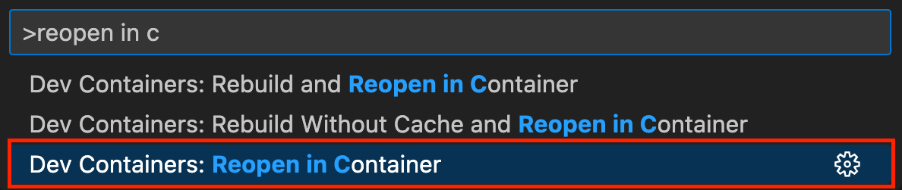

# RAGを使って独自のChatGPTを作成する

このワークショップでは、ドキュメントのコーパスに基づいたカスタムChatGPTエクスペリエンスの基本を探ります。ベクターデータベースを作成し、PDFドキュメントからデータを入力し、チャットウェブサイトとAPIを構築して、これらのドキュメントに含まれる情報に関する質問に答えることができるようにします。

## 学ぶことができる内容

- ベクターデータベースを使用してナレッジベースを作成する。
- ドキュメントをベクターデータベースに取り込む。
- [Fastify](https://www.fastify.io)を使用してWeb APIを作成する。
- [OpenAI](https://openai.com)モデルと[LangChain.js](https://js.langchain.com/docs/)を使用して、プロンプトに基づいて回答を生成する。
- ベクターデータベースをクエリし、プロンプトを拡張して応答を生成する。
- Web APIをChatGPTのようなウェブサイトに接続する。
- アプリケーションをAzureにデプロイする。

## 前提条件

<div data-hidden="$$proxy$$">

| | |
|----------------------|------------------------------------------------------|
| GitHubアカウント       | [無料のGitHubアカウントを取得](https://github.com/join) |
| Azureアカウント        | [無料のAzureアカウントを取得](https://azure.microsoft.com/free) |
| Azure OpenAI APIへのアクセス | [Azure OpenAIへのアクセスをリクエスト](https://aka.ms/oaiapply) |
| Webブラウザ        | [Microsoft Edgeを取得](https://www.microsoft.com/edge) |
| JavaScriptの知識 | [MDNドキュメントのJavaScriptチュートリアル](https://developer.mozilla.org/docs/Web/JavaScript)<br>[YouTubeのJavaScript for Beginners](https://www.youtube.com/playlist?list=PLlrxD0HtieHhW0NCG7M536uHGOtJ95Ut2) |

</div>

<div data-visible="$$proxy$$">

| | |
|----------------------|------------------------------------------------------|
| GitHubアカウント       | [無料のGitHubアカウントを取得](https://github.com/join) |
| Webブラウザ        | [Microsoft Edgeを取得](https://www.microsoft.com/edge) |
| JavaScriptの知識 | [MDNドキュメントのJavaScriptチュートリアル](https://developer.mozilla.org/docs/Web/JavaScript)<br>[YouTubeのJavaScript for Beginners](https://www.youtube.com/playlist?list=PLlrxD0HtieHhW0NCG7M536uHGOtJ95Ut2) |

</div>

[GitHub Codespaces](https://github.com/features/codespaces)を使用して、このワークショップのために準備されたインスタント開発環境を利用します。

ローカルで作業することを希望する場合は、VS Codeと[dev container](https://aka.ms/vscode/ext/devcontainer)を使用するか、必要なツールを手動でインストールしてローカル開発環境を設定する手順も提供します。

<div class="info" data-title="note" data-hidden="$$proxy$$">

> Azureアカウントには、`Microsoft.Authorization/roleAssignments/write`権限が必要です。例えば、[ロールベースアクセス制御管理者](https://learn.microsoft.com/azure/role-based-access-control/built-in-roles#role-based-access-control-administrator-preview)、[ユーザーアクセス管理者](https://learn.microsoft.com/azure/role-based-access-control/built-in-roles#user-access-administrator)、または[所有者](https://learn.microsoft.com/azure/role-based-access-control/built-in-roles#owner)などです。また、Azureリソースのデプロイを許可するために、サブスクリプションレベルで`Microsoft.Resources/deployments/write`権限も必要です。
>
> 個人のAzureサブスクリプションを使用している場合は問題ありません。会社から提供されたAzureサブスクリプションを使用している場合は、必要な権限があることを確認するためにIT部門に連絡する必要があるかもしれません。

</div>

---

## はじめに

あらゆる規模の組織は、時間の経過とともに膨大なドキュメントを蓄積してきました。ChatGPTのような生成AIは、一般的な知識や歴史的な出来事についての回答を合理的な精度で提供できますが、企業の内部ドキュメントに基づいて質問に答えるようにカスタマイズすることもできます。

<div class="info" data-title="note">

> **生成AIの精度** 
> ChatGPTを支える大規模言語モデル（LLM）は、高精度な回答を提供するようには設計されていません。権威あるように見えるが実際には誤っている回答を提供する「幻覚」を生み出すことがあります。**AI生成の回答であることをユーザーに知らせる**ことが重要です。このワークショップでは、情報源にリンクする回答を生成する方法を探ります。これを*グラウンディング*と呼び、ユーザーがAIの回答の正確性を確認できるようにします。

</div>

このワークショップでは、ドキュメントに基づいて回答を生成するチャットアプリケーションを構築し、Azureにデプロイする方法をガイドします。さまざまなトピックに触れますが、一歩一歩進めていきます。

### アプリケーションアーキテクチャ

以下は、構築するアプリケーションのアーキテクチャです：


アプリケーションは主に5つのコンポーネントで構成されています：

1. **ベクターデータベース**: ベクターデータベースは、ドキュメントの数学的表現（_埋め込み_）を保存します。これらは、ユーザーの質問に関連するドキュメントを見つけるためにチャットAPIによって使用されます。

2. **インジェストサービス**: インジェストサービスは、ドキュメントからこのベクターデータベースにデータを供給します。

3. **チャットAPI**: このAPIは、クライアントアプリケーションがチャットメッセージを送信し、ベクターデータベース内のドキュメントに基づいて生成された回答を受け取ることを可能にします。

4. **チャットウェブサイト**: このサイトは、ユーザーが質問をして、取り込まれたドキュメントに関する回答を受け取るためのChatGPTのようなインターフェースを提供します。

5. **OpenAIモデルデプロイメント**: このワークショップでは、Azureにホストされた ~~`gpt-3.5-turbo`~~ `gpt-4o-mini`モデルを使用します。このコードは、OpenAIのAPIやOllameと最小限の変更で動作するように適応することもできます。

### Retrieval-Augmented Generationとは？

Retrieval-Augmented Generation（RAG）は、自然言語処理における2つの異なるアプローチの強みを組み合わせた強力な技術です。これにより、コンテキストに関連し、内容が豊富な応答を生成することができます。このハイブリッドアプローチは、カスタムChatGPTのようなモデルを作成する際にどのように機能するかを説明します。

RAGの中心には、2つの主要なコンポーネントがあります：

- **リトリーバー**: "_検索エンジンのように_"、データベースから関連情報を見つけます。リトリーバーは通常、ベクターデータベースを検索します。特定のユースケースでは、アプリケーションデータベース、API、その他の情報源を検索することもあります。このワークショップでは、このロジックを_チャットAPI_に実装します。

- **ジェネレーター**: ライターのように振る舞い、プロンプトと取得した情報を基に応答を作成します。このワークショップでは、OpenAIの ~~`gpt-3.5-turbo`~~ `gpt-4o-mini`がジェネレーターとして機能します。


RAGプロセスは以下のステップで構成されます：

1. **埋め込み計算**: ユーザーのプロンプトを類似性比較のための埋め込みに変換します。

2. **ドキュメント取得**: プロンプトの埋め込みを使用して最も関連性の高いドキュメントを見つけます。ここで、Azure AI Searchのようなシステムが効率的なベクタ類似性検索を可能にします。

3. **コンテキストの拡張**: 取得したドキュメントからの情報でユーザープロンプトを強化します。このステップは、生成された応答に追加のコンテキストと情報を提供するために重要です。

4. **応答生成**: 拡張されたプロンプトを使用してモデルが応答を生成します。モデルは、取得したドキュメントによって提供された追加のコンテキストを使用して、より情報に基づいた正確な出力を生成します。


---

## 準備

開発に入る前に、プロジェクト環境を設定しましょう。これには以下が含まれます：

- テンプレートに基づいてGitHubで新しいプロジェクトを作成する
- [GitHub Codespaces](https://github.com/features/codespaces)または[VS CodeのDev Containers拡張機能](https://aka.ms/vscode/ext/devcontainer)（または必要なツールの手動インストール）を使用して準備された開発環境を使用する

### プロジェクトの作成

1. [このGitHubリポジトリ](https://github.com/Azure-Samples/azure-openai-rag-workshop)を開きます。  
※[日本語簡易版はこちらのGitHubリポジトリ](https://github.com/kanazawazawa/azure-openai-rag-workshop-jp/)を開きます。  
2. **Fork**ボタンをクリックし、**Create fork**をクリックして、プロジェクトのコピーを自分のGitHubアカウントに作成します。


フォークが作成されたら、**Code**ボタンを選択し、**Codespaces**タブをクリックして**Create Codespaces on main**をクリックします。


これにより、必要なツールが事前にインストールされた開発コンテナが初期化されます。準備が整うと、コーディングを開始するために必要なすべてが揃います。UIが読み込まれた後、すべてが完全に準備されるまで数分待ちます。`npm install`でnpmパッケージのインストールなどのタスクがトリガーされるためです。

<div class="info" data-title="note">

> GitHub Codespacesは、すべてのGitHubユーザーに対して月間最大60時間の無料使用を提供します。詳細については[GitHubの料金詳細](https://github.com/features/codespaces)を確認してください。

</div>

#### [オプション] Devコンテナを使用したローカル開発

ローカルマシンで作業することを希望する場合、Devコンテナをローカルマシンで実行することもできます。Codespacesを使用する場合は、次のセクションに直接進むことができます。

1. [Docker](https://www.docker.com/products/docker-desktop)、[VS Code](https://code.visualstudio.com/)、および[Dev Containers拡張機能](https://aka.ms/vscode/ext/devcontainer)がインストールされていることを確認します。

<div class="tip" data-title="tip">

> Dev Containersについて詳しくは[このビデオシリーズ](https://learn.microsoft.com/shows/beginners-series-to-dev-containers/)をご覧ください。また、[ウェブサイト](https://containers.dev)や[仕様](https://github.com/devcontainers/spec)も確認できます。

</div>

2. GitHubのウェブサイトで、**Code**ボタンを選択し、**Local**タブをクリックしてリポジトリのURLをコピーします。


3. フォークしたリポジトリをクローンし、フォルダをVS Codeで開きます：

   ```bash
   git clone <your_repository_url>
   ```

3. VS Codeで、`Ctrl+Shift+P`（macOSでは`Command+Shift+P`）を使用して**コマンドパレット**を開き、**Reopen in Container**と入力します。

   

   *Altテキスト: VS Codeで「Reopen in Container」コマンドを表示するスクリーンショット。*

初回はコンテナイメージのダウンロードと設定に時間がかかります。その間に次のセクションを読み進めることができます。

コンテナが準備完了になると、VS Codeの左下に「Dev Container: OpenAI Workshop」と表示されます：


#### [オプション] Devコンテナを使用せずにローカルで作業する

Devコンテナを使用せずにローカルで作業する場合、プロジェクトをクローンし、以下のツールをインストールする必要があります：

| | |
|---------------|--------------------------------|
| Git           | [Gitを取得](https://git-scm.com) |
| Docker v20+   | [Dockerを取得](https://docs.docker.com/get-docker) |
| Node.js v20+  | [Node.jsを取得](https://nodejs.org) |
| GitHub CLI    | [GitHub CLIを取得](https://cli.github.com/manual/installation) |
| Azure Developer CLI | [Azure Developer CLIを取得](https://learn.microsoft.com/azure/developer/azure-developer-cli/install-azd) |
| Bash v3+      | [bashを取得](https://www.gnu.org/software/bash/)（WindowsユーザーはGitに付属の**Git bash**を使用できます） |
| コードエディタ | [VS Codeを取得](https://aka.ms/get-vscode) |

セットアップをテストするには、ターミナルを開いて以下のコマンドを入力します：

```sh
git --version
docker --version
node --version
gh --version
azd version
gh --version
bash --version
```


---

## セットアップの完了

テンプレートのセットアップを完了するには、プロジェクトのルートで以下のコマンドをターミナルで実行してください：

```bash
./scripts/setup-template.sh aisearch
```


---