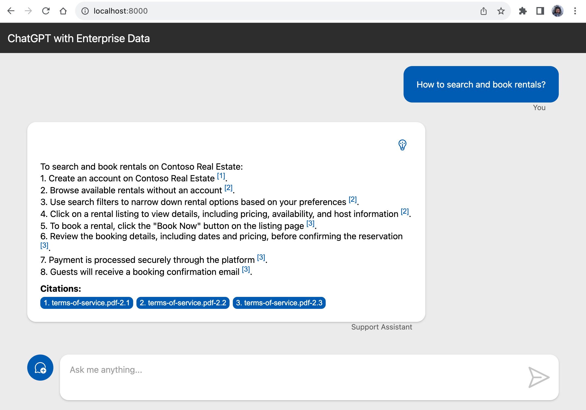

<div class="info" data-title="スキップ通知">

> Dockerfileの実装をスキップして次のセクションに進みたい場合は、プロジェクトのルートでこのコマンドを実行して、完成したコードを直接取得してください:
> ```bash
> curl -fsSL https://github.com/Azure-Samples/azure-openai-rag-workshop/releases/download/latest/backend-dockerfile-aisearch.tar.gz | tar -xvz
> ```

<div>

## Dockerfileを作成する

もう少しで完成です。APIをコンテナ化しましょう！コンテナはアプリケーションをパッケージ化してデプロイするのに最適な方法です。ホスト環境からアプリケーションを分離し、開発者のラップトップからクラウドプロバイダーまで、どんな環境でも実行できます。

私たちのChat APIにはTypeScriptコードをJavaScriptにコンパイルする**ビルド**ステップがあるため、Dockerの[マルチステージ](https://docs.docker.com/build/building/multi-stage/)機能を使用してAPIをビルドし、Dockerfileを読みやすく保ちながら小さなコンテナイメージを作成します。

### ビルドステージの定義

`src/backend`フォルダーに`Dockerfile`を作成して、APIのDockerイメージをビルドしましょう:

```dockerfile
# syntax=docker/dockerfile:1

# Node.jsアプリをビルド
# ------------------------------------
FROM node:20-alpine as build
WORKDIR /app
COPY ./package*.json ./
COPY ./src/backend ./src/backend
RUN npm ci --cache /tmp/empty-cache
RUN npm run build --workspace=backend
```

最初のステートメント`FROM node:20-alpine`は、Node.js 20がインストールされた[nodeイメージ](https://hub.docker.com/_/node)をベースとして使用することを意味します。`alpine`バリアントは軽量版のイメージで、コンテナサイズが小さくなり、プロダクション環境に最適です。`as build`ステートメントでこのステージを`build`と名付け、後で参照できるようにします。

その後、`WORKDIR /app`で作業ディレクトリを指定します。プロジェクトファイルをコンテナにコピーする必要があります。NPMワークスペースを使用しているため、`./src/backend`フォルダーをコピーするだけでは不十分で、ルートの`package.json`ファイルと、特に`package-lock.json`ファイルもコピーする必要があります。これにより、依存関係がローカル環境と同じバージョンでインストールされます。

次に`npm ci`コマンドを実行します。`--cache /tmp/empty-cache`は、空のキャッシュフォルダーを使用するようにNPMに指示し、コンテナにダウンロードキャッシュを保存しないようにします。これは必須ではありませんが、コンテナを必要以上に大きくしないための良いプラクティスです。

最後に`npm run build`コマンドを実行してAPIをビルドします。NPMワークスペースを使用しているため、`--workspace=backend`オプションを指定してビルドするワークスペースを指定する必要があります。

### 最終イメージの作成

次に、最終的なDockerイメージを作成するための第二ステージを作成します。以下のコードを最初のステージの後に追加します:

```dockerfile
# Node.jsアプリを実行
# ------------------------------------
FROM node:20-alpine
ENV NODE_ENV=production

WORKDIR /app
COPY ./package*.json ./
COPY ./src/backend/package.json ./src/backend/
RUN npm ci --omit=dev --workspace=backend --cache /tmp/empty-cache
COPY --from=build app/src/backend/dist src/backend/dist
EXPOSE 3000
CMD [ "npm", "start", "--workspace=backend" ]
```

このステージは最初のステージと非常に似ていますが、いくつかの違いがあります:

- 第二ステートメント`ENV NODE_ENV=production`は、`NODE_ENV`環境変数を`production`に設定します。これはNode.jsエコシステムでアプリがプロダクションモードで実行されていることを示すための慣習です。ほとんどのフレームワークでプロダクション最適化が有効になります。
- 今回は`src/backend`フォルダー全体をコピーするのではなく、`package.json`ファイルのみをコピーします。このファイルは依存関係をインストールするために必要ですが、ソースコードをコピーする必要はありません。
- `npm ci`コマンドの`--omit=dev`オプションを使用して、プロダクション依存関係のみをインストールします。最終的なDockerイメージには開発依存関係は不要です。
- `COPY`命令の`--from=build`オプションを使用して、最初のステージからコンパイルされたコードをコピーします。これにより、最初のステージから最終的なDockerイメージにコンパイルされたコードをコピーします。

最後に、ポート`3000`を公開し、コンテナが起動したときに`npm start --workspace=backend`コマンドを実行するようにDockerに指示します。

このセットアップにより、Dockerは最初にアプリをビルドするためのコンテナを作成し、その後、最初のコンテナからコンパイルされたアプリコードをコピーして最終的なDockerイメージを作成します。

### Dockerイメージをビルドする

Dockerイメージが正しくビルドされるかどうかをテストできます。まず、`src/backend/package.json`ファイルにあるDockerイメージをビルドして実行するコマンドを見てみましょう:

```json
{
  "scripts": {
    "docker:build": "docker build --tag backend --file ./Dockerfile ../..",
    "docker:run": "docker run --rm --publish 3000:3000 --env-file ../../.env backend",
  },
}
```

次に、`backend`フォルダーからこのコマンドを実行してイメージをビルドします:

```bash
npm run docker:build
```

ビルドが成功した場合は、次のセクションに進むことができます。エラーが発生した場合は、Dockerfileのセクションを見逃していないか、バックエンドコードが正しくコンパイルされているかを確認してください。

その後、進捗を追跡するためにリポジトリに変更をコミットします。

<div class="info" data-title="注意">

> `npm run docker:run`コマンドでイメージを実行しようとすると、`@azure/identity` SDKがローカルコンテナで自動的に認証できないため、エラーが発生します。
> これを修正する方法はいくつかありますが、最も簡単なのは[サービスプリンシパル](https://learn.microsoft.com/entra/identity-platform/howto-create-service-principal-portal)を作成し、必要な権限を割り当て、環境変数をコンテナに渡すことです。しかし、これはこのワークショップの範囲を超えるため、このステップはスキップします。

</div>


---

<div class="info" data-title="スキップ通知">

> チャットウェブサイトの実装をスキップして次のセクションに進みたい場合は、プロジェクトのルートでこのコマンドを実行して、完成したコードを直接取得してください:
> ```bash
> curl -fsSL https://github.com/Azure-Samples/azure-openai-rag-workshop/releases/download/latest/frontend.tar.gz | tar -xvz
> ```

<div>

## チャットウェブサイト

Chat APIが完成したので、それを使用するウェブサイトを完成させる時が来ました。

### ViteとLitの紹介

フロントエンドのビルドツールとして[Vite](https://vitejs.dev/)を、ウェブコンポーネントライブラリとして[Lit](https://lit.dev/)を使用します。

このフロントエンドはシングルページアプリケーション（SPA）として構築され、よく知られているChatGPTウェブサイトに似たものになります。主な違いは、前のセクションで説明したChat APIからデータを取得することです。

プロジェクトは`src/frontend`フォルダーにあります。プロジェクトディレクトリからこのコマンドを実行して開発サーバーを開始できます:

```bash
cd src/frontend
npm run dev
```

これにより、開発モードでアプリケーションが開始されます。ブラウザで[http://localhost:8000](http://localhost:8000)を開いて表示します。

<div class="tip" data-title="ヒント">

> 開発モードでは、コードに変更を加えるとウェブページが自動的にリロードされます。このコマンドをバックグラウンドで実行し続け、IDEとウェブブラウザを並べて表示することをお勧めします。IDEでコードを編集し、ウェブブラウザで最終結果を確認できます。

</div>

### チャットウェブコンポーネント

チャットウェブコンポーネントはすでに構築されているので、チャットAPIの接続に集中できます。ウェブコンポーネントの良いところは、HTML要素であるため、どのフレームワークでも、またはフレームワークなしでも使用できることです。このワークショップでもそのように使用します。

その結果、このコンポーネントを自分のプロジェクトで再利用し、必要に応じてカスタマイズできます。

コンポーネントは`src/frontend/src/components/chat.ts`ファイルにあります。動作が気になる場合は、ファイルを確認してください。

コンポーネントをカスタマイズしたい場合は、`src/frontend/src/components/chat.ts`ファイルを編集します。さまざまなHTMLレンダリングメソッドは`renderXxx`と呼ばれています。たとえば、回答が読み込まれている間にスピナーを表示するために使用される`renderLoader`メソッドは次のとおりです:

```ts
protected renderLoader = () => {
  return this.isLoading && !this.isStreaming
    ? html`
        <div class="message assistant loader">
          <div class="message-body">
            <slot name="loader"><div class="loader-animation"></div></slot>
            <div class="message-role">${this.options.strings.assistant}</div>
          </div>
        </div>
      `
    : nothing;
};
```

### チャットAPIの呼び出し

次に、先ほど作成したチャットAPIを呼び出す必要があります。これには、`src/frontend/src/api.ts`ファイルを編集し、`TODO`コメントがある場所にコードを完成させます:

```ts
// TODO: complete call to Chat API here
// const response =
```

ここでは、[Fetch Web API](https://developer.mozilla.org/docs/Web/API/Fetch_API/Using_Fetch)を使用してチャットAPIを呼び出すことができます。APIのURLはすでに`apiUrl`プロパティにあります。

リクエストのボディには、`options.messages`プロパティにあるメッセージを含むJSON文字列を渡す必要があります。

さあ、コードを完成させましょう！🙂

<details>
<summary>例の解決策を見るにはここをクリック</summary>

```ts
const response = await fetch(`${apiUrl}/chat`, {
  method: 'POST',
  headers: { 'Content-Type': 'application/json' },
  body: JSON.stringify({
    messages: options.messages,
  }),
});
```

</details>

このメソッドは、Webコンポーネントの`onSendClicked`メソッドから呼び出されます。

### 完成したウェブサイトのテスト

コードを完成させたら、アプリケーションをテストするためにバックエンドも実行する必要があります。フロントエンドサーバーを実行し続け、新しいターミナルを開いてバックエンドを実行します:

```bash
npm run dev --workspace=backend
```

`--workspace=backend`オプションを指定することで、現在のディレクトリに関係なく、NPMに`backend`ワークスペースで`dev`スクリプトを実行するように指示します。

ブラウザに戻り、チャットボットに質問を送信します。チャットウィンドウに回答が表示されるはずです。




---

## Azureへのデプロイ

アプリケーションはAzureにデプロイする準備が整いました！

フロントエンドをデプロイするために[Azure Static Web Apps](https://learn.microsoft.com/azure/static-web-apps/overview)を使用し、バックエンドとインジェクションサービスをデプロイするために[Azure Container Apps](https://learn.microsoft.com/azure/container-apps/overview)を使用します。

プロジェクトのルートからこのコマンドを実行して、アプリケーションをビルドしてデプロイします（このコマンドはプロジェクトルートにある`azure.yaml`ファイルにリストされているすべてのサービスをデプロイします）:

```bash
azd deploy
```

このプロセスには数分かかる場合があります。完了すると、コマンドの出力にデプロイされたフロントエンドアプリケーションのURLが表示されます。


このURLをブラウザで開き、デプロイされたアプリケーションをテストできます。


<div class="tip" data-title="ヒント">

> `azd deploy <service_name>`コマンドを実行して、サービスを個別にビルドおよびデプロイすることもできます。これにより、必要に応じてバックエンド、フロントエンド、およびインジェクションサービスを独立してデプロイできます。
>
> さらに良いことに！最初から始めて完成したコードがある場合は、`azd up`コマンドを使用できます。このコマンドは`azd provision`と`azd deploy`の両方を組み合わせて、Azureリソースをプロビジョニングし、1つのコマンドでアプリケーションをデプロイします。

</div>


---