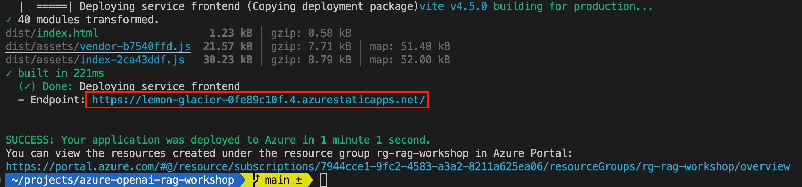
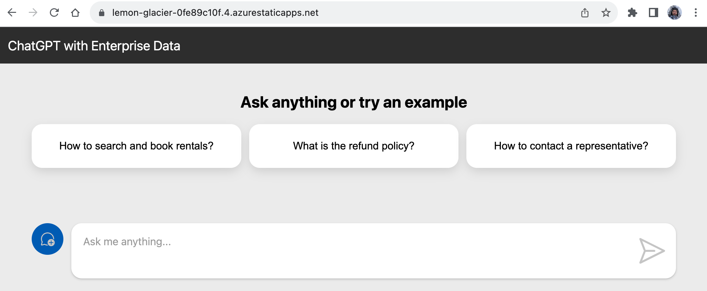

## Dockerfileを作成する

もう少しで完成です。APIをコンテナ化しましょう！コンテナはアプリケーションをパッケージ化してデプロイするのに最適な方法です。ホスト環境からアプリケーションを分離し、開発者のラップトップからクラウドプロバイダーまで、どんな環境でも実行できます。

私たちのChat APIにはTypeScriptコードをJavaScriptにコンパイルする**ビルド**ステップがあるため、Dockerの[マルチステージ](https://docs.docker.com/build/building/multi-stage/)機能を使用してAPIをビルドし、Dockerfileを読みやすく保ちながら小さなコンテナイメージを作成します。

### ビルドステージの定義、最終イメージの作成

`src/backend`フォルダーに`Dockerfile`を作成して、APIのDockerイメージをビルドしましょう:

```dockerfile
# syntax=docker/dockerfile:1

# Node.jsアプリをビルド
# ------------------------------------
FROM node:20-alpine as build
WORKDIR /app
COPY ./package*.json ./
COPY ./src/backend ./src/backend
RUN npm ci --cache /tmp/empty-cache
RUN npm run build --workspace=backend

FROM node:20-alpine
ENV NODE_ENV=production

WORKDIR /app
COPY ./package*.json ./
COPY ./src/backend/package.json ./src/backend/
RUN npm ci --omit=dev --workspace=backend --cache /tmp/empty-cache
COPY --from=build app/src/backend/dist src/backend/dist
EXPOSE 3000
CMD [ "npm", "start", "--workspace=backend" ]
```

このセットアップにより、Dockerは最初にアプリをビルドするためのコンテナを作成し、その後、最初のコンテナからコンパイルされたアプリコードをコピーして最終的なDockerイメージを作成します。

### Dockerイメージをビルドする

Dockerイメージが正しくビルドされるかどうかをテストできます。
`backend`フォルダーからこのコマンドを実行してイメージをビルドします:

```bash
npm run docker:build
```

ビルドが成功した場合は、次のセクションに進むことができます。エラーが発生した場合は、Dockerfileのセクションを見逃していないか、バックエンドコードが正しくコンパイルされているかを確認してください。

その後、進捗を追跡するためにリポジトリに変更をコミットします。

<div class="info" data-title="注意">

> `npm run docker:run`コマンドでイメージを実行しようとすると、`@azure/identity` SDKがローカルコンテナで自動的に認証できないため、エラーが発生します。
> これを修正する方法はいくつかありますが、最も簡単なのは[サービスプリンシパル](https://learn.microsoft.com/entra/identity-platform/howto-create-service-principal-portal)を作成し、必要な権限を割り当て、環境変数をコンテナに渡すことです。しかし、これはこのワークショップの範囲を超えるため、このステップはスキップします。

</div>


## チャットウェブサイト

Chat APIが完成したので、それを使用するウェブサイトを完成させる時が来ました。

### チャットAPIの呼び出し

次に、先ほど作成したチャットAPIを呼び出す必要があります。これには、`src/frontend/src/api.ts`ファイルを編集し、`TODO`コメントがある場所にコードを完成させます:

```ts
// TODO: complete call to Chat API here
// const response =
```

ここでは、[Fetch Web API](https://developer.mozilla.org/docs/Web/API/Fetch_API/Using_Fetch)を使用してチャットAPIを呼び出すことができます。APIのURLはすでに`apiUrl`プロパティにあります。

リクエストのボディには、`options.messages`プロパティにあるメッセージを含むJSON文字列を渡す必要があります。

さあ、コードを完成させましょう！🙂

```ts
const response = await fetch(`${apiUrl}/chat`, {
  method: 'POST',
  headers: { 'Content-Type': 'application/json' },
  body: JSON.stringify({
    messages: options.messages,
  }),
});
```

このメソッドは、Webコンポーネントの`onSendClicked`メソッドから呼び出されます。

## Azureへのデプロイ

アプリケーションはAzureにデプロイする準備が整いました！

フロントエンドをデプロイするために[Azure Static Web Apps](https://learn.microsoft.com/azure/static-web-apps/overview)を使用し、バックエンドとインジェクションサービスをデプロイするために[Azure Container Apps](https://learn.microsoft.com/azure/container-apps/overview)を使用します。

プロジェクトのルートからこのコマンドを実行して、アプリケーションをビルドしてデプロイします（このコマンドはプロジェクトルートにある`azure.yaml`ファイルにリストされているすべてのサービスをデプロイします）:

```bash
azd deploy
```

このプロセスには数分かかる場合があります。完了すると、コマンドの出力にデプロイされたフロントエンドアプリケーションのURLが表示されます。



このURLをブラウザで開き、デプロイされたアプリケーションをテストできます。



<div class="tip" data-title="ヒント">

> `azd deploy <service_name>`コマンドを実行して、サービスを個別にビルドおよびデプロイすることもできます。これにより、必要に応じてバックエンド、フロントエンド、およびインジェクションサービスを独立してデプロイできます。
>
> さらに良いことに！最初から始めて完成したコードがある場合は、`azd up`コマンドを使用できます。このコマンドは`azd provision`と`azd deploy`の両方を組み合わせて、Azureリソースをプロビジョニングし、1つのコマンドでアプリケーションをデプロイします。

</div>


---