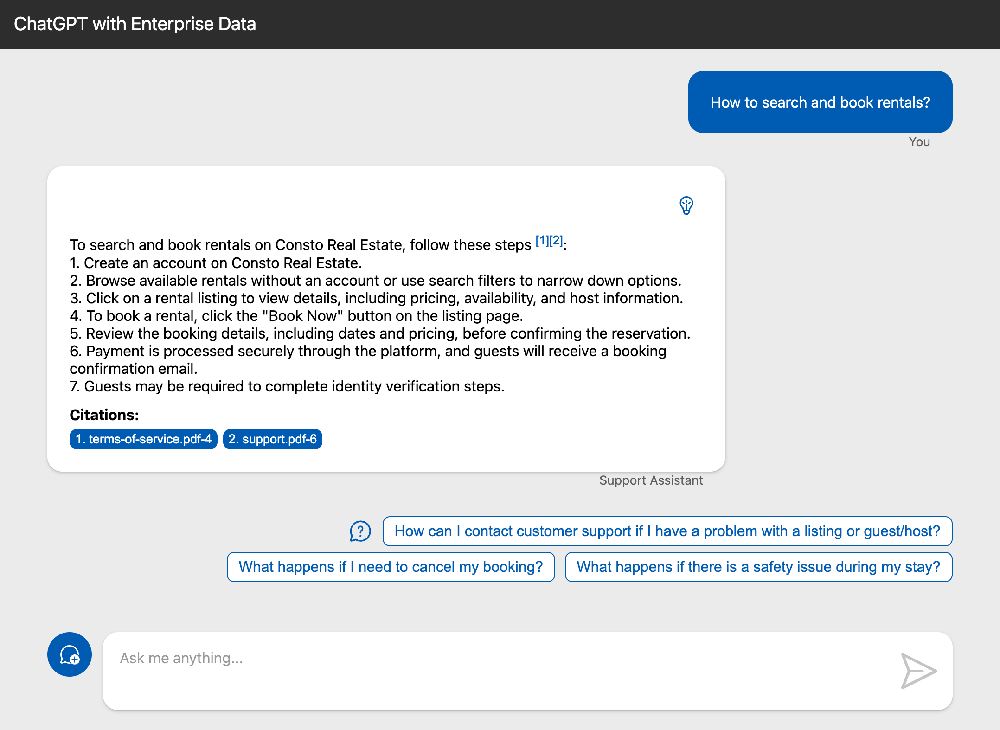
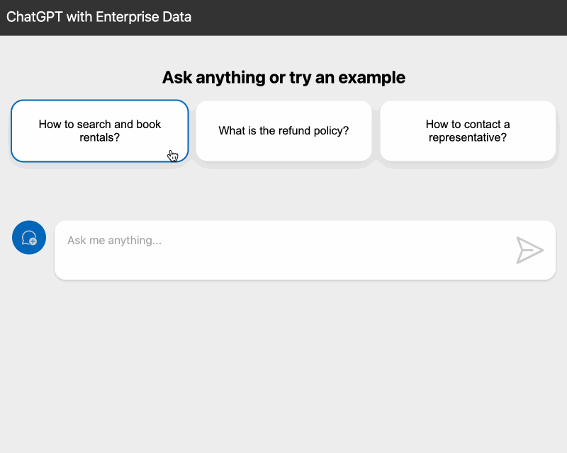

<div class="info" data-title="skip notice">

> このステップは完全にオプションです。次のセクションに直接進みたい場合はスキップできます。

</div>

## オプションの改善

現在、動作するアプリケーションがありますが、フォローアップ質問機能を追加するなど、さらに改善できる点がいくつかあります。

### フォローアップ質問を追加する

チャットボットがユーザーの質問に答えた後、ユーザーが必要な情報を見つけるのを助けるために、いくつかのフォローアップ質問を提供することが有用です。

そのためには、元のプロンプトを改善します。ファイル `src/backend/src/plugins/chat.ts` を開き、システムプロンプトの下に次のコードを追加します：

```ts
const FOLLOW_UP_QUESTIONS_PROMPT = `Generate 3 very brief follow-up questions that the user would likely ask next.
Enclose the follow-up questions in double angle brackets. Example:
<<Am I allowed to invite friends for a party?>>
<<How can I ask for a refund?>>
<<What If I break something?>>

Do no repeat questions that have already been asked.
Make sure the last question ends with ">>".`;
```

```ts
const FOLLOW_UP_QUESTIONS_PROMPT = `ユーザーが次に尋ねそうな非常に簡潔なフォローアップ質問を3つ生成してください。
フォローアップ質問を二重山括弧で囲んでください。例：
<<友達をパーティーに招待してもいいですか？>>
<<返金を求めるにはどうすればいいですか？>>
<<何かを壊した場合はどうなりますか？>>

既に尋ねられた質問を繰り返さないでください。
最後の質問が ">>" で終わるようにしてください。`;
```

このプロンプトを分析して、何が起こっているのかを理解しましょう：

1. モデルに3つのフォローアップ質問を生成するように依頼します：`ユーザーが次に尋ねそうな非常に簡潔なフォローアップ質問を3つ生成してください。`
2. フォローアップ質問の形式を指定します：`フォローアップ質問を二重山括弧で囲んでください。`
3. フォローアップ質問の例を示すために少数ショットアプローチを使用します：
    ```
    <<友達をパーティーに招待してもいいですか？>>
    <<返金を求めるにはどうすればいいですか？>>
    <<何かを壊した場合はどうなりますか？>>
    ```
4. テストに基づいて、プロンプトをさらにルールで改善します：`既に尋ねられた質問を繰り返さないでください。` と `最後の質問が ">>" で終わるようにしてください。`

プロンプトができたので、システムプロンプトに追加する必要があります。
チャットサービスのこの行を置き換えます：

```ts
const systemMessage = SYSTEM_MESSAGE_PROMPT;
```

次のように置き換えます：

```ts
const systemMessage = SYSTEM_MESSAGE_PROMPT + FOLLOW_UP_QUESTIONS_PROMPT;
```

これで完了です！
リポジトリのルートで `npm start` を実行してアプリケーションを開始し、変更をテストできます。このコマンドはバックエンドとフロントエンドの両方を開発モードで開始するので、変更をテストできます。

チャットウェブアプリで、回答の後にフォローアップ質問が表示されるはずです：



`azd deploy backend` を実行して改善されたバックエンドを再デプロイし、本番環境でテストできます。

### ストリーミングサポートを追加する

現在のチャットAPIバージョンは、メッセージを送信し、モデルが生成を完了した後に応答を取得するために `chat` エンドポイントを使用しています。これはユーザーにとって待ち時間が長くなり、理想的ではありません。

OpenAI APIには、応答メッセージをストリーミングするオプションがあり、生成されるとすぐに応答を表示できます。
これにより、モデルが応答を生成する速度が速くなるわけではありませんが、生成中に直接応答を読み始めることができるため、ユーザーにとって応答を表示する速度が速くなります。

#### バックエンドにストリーミングを実装する

ストリーミングを有効にするために、まずバックエンドに実装する必要があります。ファイル `src/backend/src/plugins/chat.ts` を開きます。

まず、`run()` メソッドのコピーを作成し、名前を `runWithStreaming()` に変更します。メソッドシグネチャを次のように更新します：

```ts
async *runWithStreaming(messages: AIChatMessage[]): AsyncGenerator<AIChatCompletionDelta, void> {
```

ここでいくつかの変更点があります：
- `async` の後の星 `*` は、このメソッドが [非同期ジェネレータ関数](https://developer.mozilla.org/docs/Web/JavaScript/Reference/Statements/async_function*#description) であることを示しています。ジェネレータは、終了して後で再入力できる関数であり、複数の値を生成できます。この場合、生成された応答チャンクを生成するために使用します。
- メソッドの戻り値の型を `AsyncGenerator<AIChatCompletionDelta, void>` に更新します。メソッドが非同期ジェネレータになったため、生成された部分的な結果を生成します。`AIChatCompletionDelta` 型は `AIChatCompletion` 型に似ていますが、`message` の代わりに `delta` プロパティを持ち、最後のチャンク以降の新しいコンテンツデルタを含みます。

シグネチャを更新したので、メソッド本体を更新して動作させる必要があります。メソッドの最後の部分を変更し、チャットクライアントを呼び出して完了結果を取得します。このコードを置き換えます：

```ts
const completion = await this.model.invoke(messageBuilder.getMessages());

return {
  message: {
    content: completion.content as string,
    role: 'assistant',
  },
  context: {
    data_points: results,
    thoughts: thoughts,
  },
};
```

次のように置き換えます：

```ts
const completion = await this.model.stream(messageBuilder.getMessages());
let id = 0;

// チャンクで完了を処理する
for await (const chunk of completion) {
  const responseChunk = {
    delta: {
      content: (chunk.content as string) ?? '',
      role: 'assistant' as const,
    },
    context: id === 0 ? {
      data_points: results,
      thoughts,
    } : {},
  };
  yield responseChunk;
  id++;
}
```

変更点を分析して、何が起こっているのかを理解しましょう：
- `invoke()` の代わりに `stream()` メソッドを呼び出します。これにより、応答チャンクを取得するために反復できる [非同期イテラブル](https://developer.mozilla.org/docs/Web/JavaScript/Reference/Iteration_protocols#the_async_iterator_and_async_iterable_protocols) が返されます。
- 応答チャンクを反復するために [for-await-of](https://developer.mozilla.org/docs/Web/JavaScript/Reference/Statements/for-await...of) を使用します。これはES2018で導入された新しい構文で、非同期イテラブルを反復することができます。
- 最初のチャンクに対してのみ `context` を埋めます。同じデータポイントと考えを各チャンクに送信したくないためです。
- `yield` を使用して応答チャンクを呼び出し元に返します。これはジェネレータから値を返すために使用される構文です。

新しいメソッドができたので、それを使用する新しい `/chat/stream` エンドポイントを追加する必要があります。ファイル `src/backend/src/routes/root.ts` を開き、次のコードを追加します：

```ts
fastify.post('/chat/stream', async function (request, reply) {
  const { messages } = request.body as any;
  try {
    const chunks = createNdJsonStream(await fastify.chat.runWithStreaming(messages));
    return reply.type('application/x-ndjson').send(Readable.from(chunks));
  } catch (_error: unknown) {
    const error = _error as Error;
    fastify.log.error(error);
    return reply.internalServerError(error.message);
  }
});
```

この場合、`run()` の代わりに `runWithStreaming()` メソッドを呼び出します。ここでの重要な違いは、応答を直接返すのではなく、新しいヘルパー関数 `createNdJsonStream()` を使用して応答チャンクを作成し、それを `Readable.from()` メソッドを使用してクライアントにストリームとして送信することです。

この新しい関数をファイルの下部に追加します：

```ts
// 応答チャンクをJSONストリームに変換する
async function* createNdJsonStream(chunks: AsyncGenerator<object>) {
  for await (const chunk of chunks) {
    // 応答チャンクを改行区切りJSON形式にフォーマットする
    // 詳細は https://github.com/ndjson/ndjson-spec を参照
    yield JSON.stringify(chunk) + '\n';
  }
}
```

チャンクをクライアントに送信するために [改行区切りJSON (ndjson) 形式](https://github.com/ndjson/ndjson-spec) を使用します。この形式は、改行で区切られたJSONオブジェクトのシーケンスです。

この時点で、`docker compose up --build` を実行してバックエンドを再度実行し、`REST Client` 拡張機能を使用するか、次のcURLコマンドを使用して変更をテストできます：

```bash
curl -X POST "http://localhost:3000/chat/stream" \
  -H "Content-Type: application/json" \
  -d '{
    "messages": [{
      "content": "レンタルの検索と予約方法は？",
      "role": "user"
    }]
  }'
```

#### フロントエンドにストリーミングを実装する

バックエンドにストリーミングサポートが追加されたので、それを使用するためにフロントエンドを更新する必要があります。ファイル `src/frontend/src/components/chat.ts` を開き、コンポーネントのデフォルトオプションで `stream` プロパティを `true` に設定します：

```ts
export const defaultOptions: ChatComponentOptions = {
  enableContentLinks: false,
  stream: true,
  ...
```

これが最終ステップでした！バックエンドがまだ実行されていることを確認し、`src/frontend` フォルダから `npm run dev` コマンドを実行してフロントエンドを開始します。生成されるとすぐにチャット応答がストリーミングされるのが見えるはずです：



`azd deploy` を実行して改善されたアプリを再デプロイし、本番環境でテストできます。

<!-- TODO: explore langchain integrations: document retrievers & tools -->


---

## 結論

これでワークショップは終了です。楽しんでいただけましたか？新しいことを学び、さらに重要なことは、この知識をプロジェクトに持ち帰ることができることを願っています。

ステップを見逃した場合や最終コードを確認したい場合は、プロジェクトのルートで次のコマンドを実行して完成したソリューションを取得できます（まずコードをコミットしてください！）：

```bash
curl -fsSL https://github.com/Azure-Samples/azure-openai-rag-workshop/releases/download/latest/solution.tar.gz | tar -xvz
```

<div class="warning" data-title="had issues?">

> ワークショップ中に問題が発生した場合は、[GitHubリポジトリで問題を作成](https://github.com/Azure-Samples/azure-openai-rag-workshop/issues) してお知らせください。

</div>

### Azureリソースのクリーンアップ

<div class="important" data-title="important">

> ワークショップが終了したら、不要なコストを避けるためにAzureリソースを削除することを忘れないでください！

</div>

Azureリソースを削除するには、次のコマンドを実行できます：

```bash
azd down --purge
```

### さらに進む

このワークショップは、エンタープライズ対応のサンプル **ChatGPT + Enterprise data with Azure OpenAI and AI Search** に基づいています：

- [JavaScriptバージョン](https://github.com/Azure-Samples/azure-search-openai-javascript)
- [Pythonバージョン](https://github.com/Azure-Samples/azure-search-openai-demo/)
- [Javaバージョン](https://github.com/Azure-Samples/azure-search-openai-demo-java)
- [C#バージョン](https://github.com/Azure-Samples/azure-search-openai-demo-csharp)
- [サーバーレスJavaScriptバージョン](https://github.com/Azure-Samples/serverless-chat-langchainjs)

より高度なユースケース、認証、履歴などをさらに進めたい場合は、ぜひチェックしてください！

### 参考文献

- このワークショップのURL: [aka.ms/ws/openai-rag](https://aka.ms/ws/openai-rag)
- このワークショップのソースリポジトリ: [GitHubリンク](https://github.com/Azure-Samples/azure-openai-rag-workshop)
- 何かがうまくいかない場合: [問題を報告](https://github.com/Azure-Samples/azure-openai-rag-workshop/issues)
- このワークショップの紹介プレゼンテーション: [スライド](https://azure-samples.github.io/azure-openai-rag-workshop/)
- ハイブリッド検索とセマンティックランキングによるベクトル検索パフォーマンスの向上: [ブログ記事](https://techcommunity.microsoft.com/t5/ai-azure-ai-services-blog/azure-ai-search-outperforming-vector-search-with-hybrid/ba-p/3929167)

