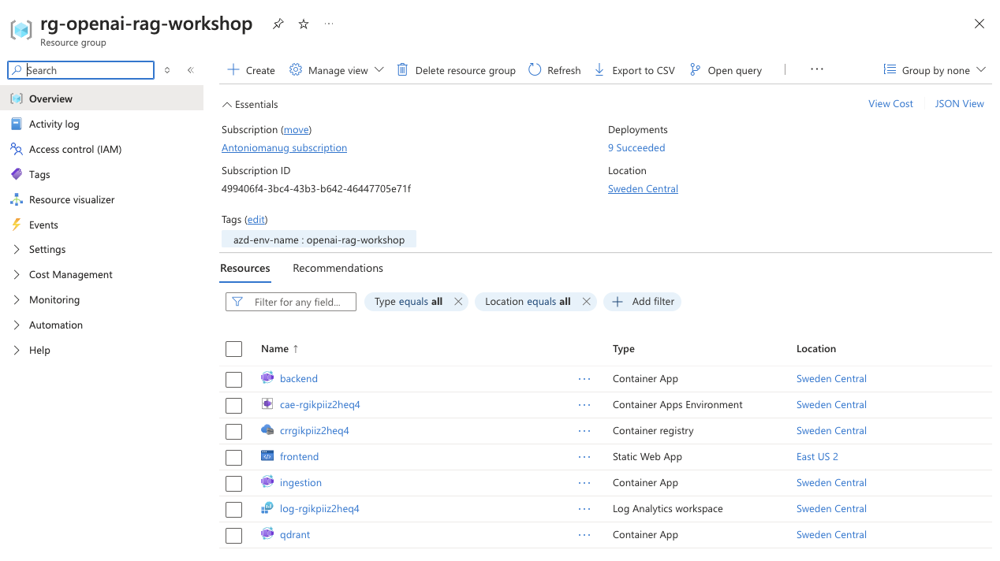
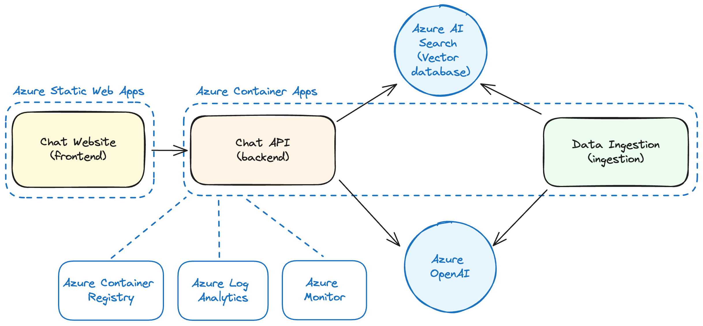
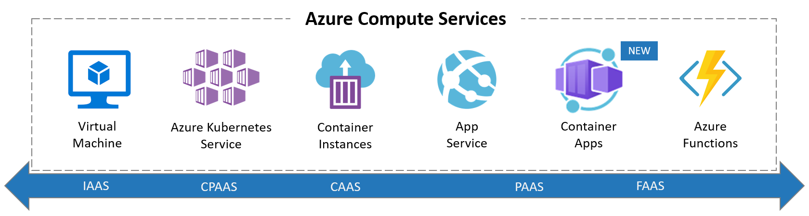
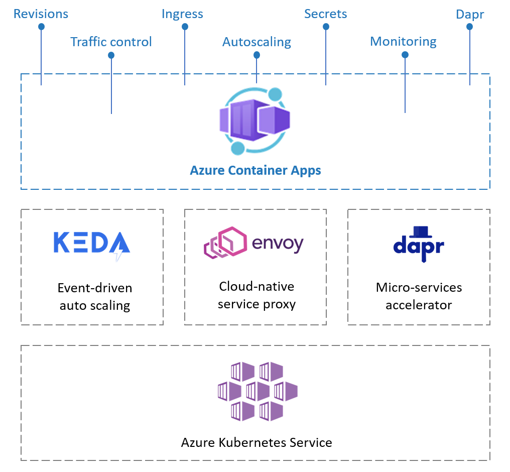

## Azureのセットアップ

[Azure](https://azure.microsoft.com)は、Microsoftが提供する包括的なクラウドプラットフォームであり、Microsoftが管理するデータセンターのグローバルネットワークを通じて、アプリケーションの構築、デプロイ、および管理を行うための多様なサービスを提供します。このワークショップでは、チャットアプリケーションを実行するためにいくつかのAzureサービスを活用します。

### Azureの始め方

<div data-hidden="$$azpass$$">

このワークショップを完了するには、Azureアカウントが必要です。まだお持ちでない場合は、[Azureのウェブサイト](https://azure.microsoft.com/free/)で無料アカウントを作成し、Azureクレジットを取得できます。

<div class="important" data-title="important">

> すでに会社のAzureアカウントをお持ちの場合、このワークショップには使用しないでください。制限があり、ワークショップを完了できない可能性があります。
> Azure Passを利用するために新しいアカウントを作成する必要があります。

</div>

</div>

<div data-visible="$$azpass$$">

このワークショップを完了するには、Azureアカウントが必要です。このワークショップに参加している場合は、以下のリンクを使用して無料のAzure Passクレジットを取得できます：[Azure Passを引き換える](https://azcheck.in/$$azpass$$)。

> このワークショップに参加していない場合は、[Azureのウェブサイト](https://azure.microsoft.com/free/)で無料アカウントを作成し、Azureクレジットを取得できます。

</div>

### プロジェクトの設定とインフラストラクチャのデプロイ

詳細に入る前に、このワークショップに必要なAzureリソースを設定しましょう。この初期設定には数分かかる場合があるため、今すぐ開始するのが良いでしょう。[Azure Developer CLI](https://learn.microsoft.com/azure/developer/azure-developer-cli/)を使用して、Azureリソースの作成と管理を簡素化します。

#### Azureにログイン

まず、次のコマンドを使用してAzureサブスクリプションにログインします：

```sh
azd auth login --use-device-code
```

複数のディレクトリに属していて、エラーが発生した場合は、tenant-id に利用される Domain 名を指定し再度実行してください。

```sh
azd auth login --tenant-id <xxxxxxx>.onmicrosoft.com --use-device-code 
```

このコマンドは、ブラウザウィンドウに入力する*デバイスコード*を提供します。プロンプトに従って、ログインが成功するまで進めてください。

#### 新しい環境を作成

次に、新しい環境を設定します。Azure Developer CLIは、設定とリソースを管理するために環境を使用します（リソースグループ名に使用されるため、同サブスクリプションで複数人が実施する場合、一意になるよう修正します）：

```sh
azd env new openai-rag-workshop
```

<div data-visible="$$proxy$$">

Open AIサービスをデプロイしたので、次のコマンドを実行して使用するOpenAI URLを設定します：

```sh
azd env set AZURE_OPENAI_API_ENDPOINT $$proxy$$
```

</div>

#### Azureインフラストラクチャのデプロイ

次に、ワークショップのAzureインフラストラクチャをデプロイします。次のコマンドを実行します：

```sh
azd provision
```

Azureサブスクリプションとデプロイメントリージョンを選択するように求められます。一般的には、ユーザーベースに最も近いリージョンを選択するのが最適ですが、このワークショップでは`West Europe`または`East US 2`のいずれかを選択してください。

<div class="info" data-title="Note">

> AI SearchやAzure Open AIなどの一部のAzureサービスは、[地域限定の提供](https://azure.microsoft.com/explore/global-infrastructure/products-by-region/?products=cognitive-services,search&regions=non-regional,europe-north,europe-west,france-central,france-south,us-central,us-east,us-east-2,us-north-central,us-south-central,us-west-central,us-west,us-west-2,us-west-3,asia-pacific-east,asia-pacific-southeast)があります。どのリージョンを選択するか不明な場合は、_East US 2_と_West Europe_が一般的に安全な選択です。

</div>

インフラストラクチャがデプロイされた後、次のコマンドを実行します：

```bash
azd env get-values > .env

# Dockerでサポートされていないため、すべての二重引用符を削除します
perl -pi -e 's/\"//g' .env
```

これにより、リポジトリのルートに`.env`ファイルが作成され、Azureサービスに接続するために必要な環境変数が含まれます。

このファイルにはアプリケーションのシークレットが含まれることがあるため、安全に保管し、リポジトリにコミットしないのがベストプラクティスです。すでに`.gitignore`ファイルに追加しているので、心配する必要はありません。

この段階で、[portal.azure.com](https://portal.azure.com)のAzureポータルにアクセスすると、次のようなものが表示されるはずです：



### 取り込みサービスのデプロイ

インフラストラクチャがデプロイされたら、すぐに取り込みサービスをデプロイできます。後で時間を節約するために、取り込みサービスを詳しく見ていきます。

```sh
azd deploy ingestion
```
```bash
chmod +x ./scripts/ingest-data.sh
```
```bash
./scripts/ingest-data.sh
```

### Azureサービスの紹介

チャットアプリケーションをデプロイするための旅では、アプリケーションのアーキテクチャとパフォーマンスに重要な役割を果たす一連のAzureサービスを利用します。



以下は、使用するAzureサービスの簡単な概要です：

| サービス | 目的 |
| ------- | ------- |
| [Azure Container Apps](https://learn.microsoft.com/azure/container-apps/) | 自動スケーリングや負荷分散などの機能を備えたコンテナ化されたアプリケーションをホストします。 |
| [Azure Static Web Apps](https://learn.microsoft.com/azure/static-web-apps/) | 統合API、認証、グローバル配信を備えた静的Webチャットを提供します。 |
| [Azure Container Registry](https://learn.microsoft.com/azure/container-registry/) | 管理されたプライベートレジストリにDockerコンテナイメージを保存します。 |
| [Azure Log Analytics](https://learn.microsoft.com/azure/log-analytics/) | アプリケーションのパフォーマンスと診断に関する洞察を得るためにテレメトリとログを収集および分析します。 |
| [Azure Monitor](https://learn.microsoft.com/azure/azure-monitor/) | アプリケーション、インフラストラクチャ、およびネットワークの包括的な監視を提供します。 |

Azure Log AnalyticsとAzure Monitorは初期の図には描かれていませんが、アプリケーションの可観測性に不可欠であり、トラブルシューティングとアプリケーションの最適な実行を確保します。

#### Azure Container Appsについて

[Azure Container Apps](https://learn.microsoft.com/azure/container-apps/overview)は、チャットアプリケーションを実行するための主要なサービスです。これはサーバーレスのコンテナサービスであり、基盤となるインフラストラクチャを抽象化し、コードの記述とデプロイに集中できるようにします。

Azure Container Appsの主な機能には次のものがあります：

- **サーバーレスの特性**：需要に応じて自動的にスケールアップまたはスケールダウンし、ゼロまでスケールダウンすることも可能です。
- **簡素化された管理**：Kubernetesクラスターやノードを管理する必要がありません。
- **統合環境**：DaprやKEDAの組み込みサポートにより、マイクロサービスの開発やイベント駆動型のスケーリングが容易になります。
- **トラフィック分割**：異なるアプリケーションリビジョン間でのトラフィックルーティングにより、A/Bテストや段階的なロールアウトが可能です。



Azure Container Appsは、PaaSとFaaSの中間に位置し、PaaSの柔軟性とFaaSのスケーリング特性を提供します。

Container Appsは[Azure Kubernetes Service](https://learn.microsoft.com/azure/aks/)の上に構築されており、KEDA（Kubernetesのイベント駆動型自動スケーリング）、Dapr（分散アプリケーションランタイム）、およびEnvoy（クラウドネイティブアプリケーション用のサービスプロキシ）との深い統合を含みます。
基盤となる複雑さは完全に抽象化されています。
したがって、Kubernetesサービス、イングレス、デプロイメント、ボリュームマニフェストを設定する必要はありません。コンテナ化されたアプリケーションのための望ましい設定を構成するための非常にシンプルなAPIとユーザーインターフェースが提供されます。
この簡素化は、制御の減少も意味し、AKSとの違いです。



Azure Container Appsは次の概念を導入します：
- *環境*：これは、Container Appsのグループの周りのセキュアな境界です。
同じ仮想ネットワークにデプロイされ、これらのアプリは相互に簡単に通信でき、同じLog Analyticsワークスペースにログを書き込みます。環境はKubernetesのネームスペースと比較できます。

- *Container App*：これは、グループとしてデプロイおよびスケールされるコンテナ（ポッド）のグループです。同じディスクスペースとネットワークを共有します。

- *リビジョン*：これは、Container Appの不変のスナップショットです。
新しいリビジョンは自動的に作成され、A/BテストなどのHTTPトラフィックリダイレクション戦略に役立ちます。

### インフラストラクチャの作成

使用するものがわかったので、このワークショップに必要なインフラストラクチャを作成しましょう。

アプリケーションを設定するために、Azure CLI、Azureポータル、ARMテンプレート、またはTerraformなどのサードパーティツールから選択できます。これらのツールはすべて、Azureのバックボーンである[Azure Resource Manager (ARM) API](https://docs.microsoft.com/azure/azure-resource-manager/management/overview)と対話します。


Azureで作成するリソースはすべて**リソースグループ**の一部です。リソースグループは、Azureソリューションの関連リソースを保持する論理コンテナであり、フォルダーのようなものです。

`azd provision`を実行すると、`rg-openai-rag-workshop`という名前のリソースグループが作成され、必要なインフラストラクチャコンポーネントがInfrastructure as Code（IaC）テンプレートを使用してデプロイされました。

### Infrastructure as Codeの紹介

Infrastructure as Code（IaC）は、構成ファイルを使用してインフラストラクチャを管理するプラクティスです。これにより、インフラストラクチャのデプロイがアプリケーションコードと同様に再現可能で一貫性のあるものになります。このコードはプロジェクトリポジトリにコミットされ、CI/CDパイプラインの一部として、またはローカルでインフラストラクチャを作成、更新、および削除するために使用できます。

Terraform、Pulumi、または[Azure Resource Manager (ARM)テンプレート](https://learn.microsoft.com/azure/azure-resource-manager/templates/overview)など、インフラストラクチャをコードとして管理するための既存のツールが多数あります。ARMテンプレートは、Azureリソースを定義および構成するためのJSONファイルです。

このワークショップでは、[Bicep](https://learn.microsoft.com/azure/azure-resource-manager/bicep/overview?tabs=bicep)を使用します。これは、ARMテンプレートの作成を簡素化する言語です。

#### Bicepとは？

Bicepは、Azureリソースを宣言的にデプロイするためのドメイン固有言語（DSL）です。明確さとシンプルさを重視して設計されており、使いやすさとコードの再利用性に焦点を当てています。ARMテンプレートの透明な抽象化であり、ARMテンプレートでできることはすべてBicepで実行できます。

以下は、Log Analyticsワークスペースを作成するBicepファイルの例です：

```bicep
resource logsWorkspace 'Microsoft.OperationalInsights/workspaces@2021-06-01' = {
  name: 'my-awesome-logs'
  location: 'westeurope'
  tags: {
    environment: 'production'
  }
  properties: {
    retentionInDays: 30
  }
}
```

リソースは異なる部分で構成されています。最初に`resource`キーワードがあり、その後にテンプレートの他の部分でそのリソースを参照するために使用できるリソースのシンボリック名が続きます。その次に、作成するリソースタイプとAPIバージョンを含む文字列があります。

<div class="info" data-title="note">

> APIバージョンは重要です。リソースタイプのテンプレートのバージョンを定義します。異なるAPIバージョンには異なるプロパティやオプションがあり、破壊的な変更を導入することがあります。APIバージョンを指定することで、製品の更新に関係なくテンプレートが機能することを保証し、インフラストラクチャの耐久性を向上させます。

</div>

リソースの内部では、リソースの名前、場所、およびプロパティを指定します。また、リソースにタグを追加することもでき、これらはリソースを分類およびフィルタリングするために使用できるキー/バリューペアです。

Bicepテンプレートはモジュール化でき、インフラストラクチャの異なる部分でコードを再利用できます。また、パラメーターを受け入れることができ、インフラストラクチャを異なる環境や条件に動的に適応させることができます。

このワークショップのBicepファイルの構造を確認するには、`./infra`ディレクトリを探索してください。`main.bicep`ファイルがエントリーポイントであり、`./infra/core`フォルダーにあるさまざまなモジュールをオーケストレーションします。

Bicepはテンプレート作成プロセスを簡素化し、[Azure Quickstart Templates](https://github.com/Azure/azure-quickstart-templates/tree/master/quickstarts)から既存のテンプレートを使用したり、[Bicep VS Code拡張機能](https://marketplace.visualstudio.com/items?itemName=ms-azuretools.vscode-bicep)を使用して支援を受けたり、[Bicepプレイグラウンド](https://aka.ms/bicepdemo)でARMとBicep形式の間で変換を試したりできます。


---