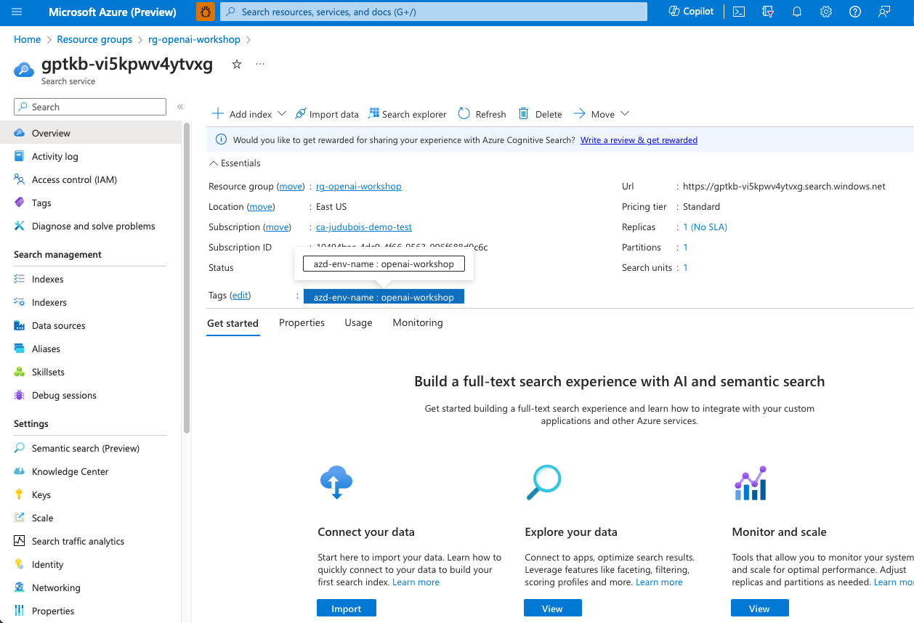
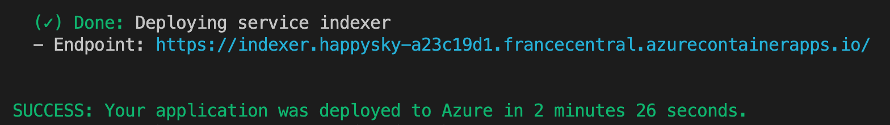
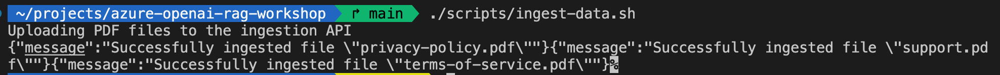
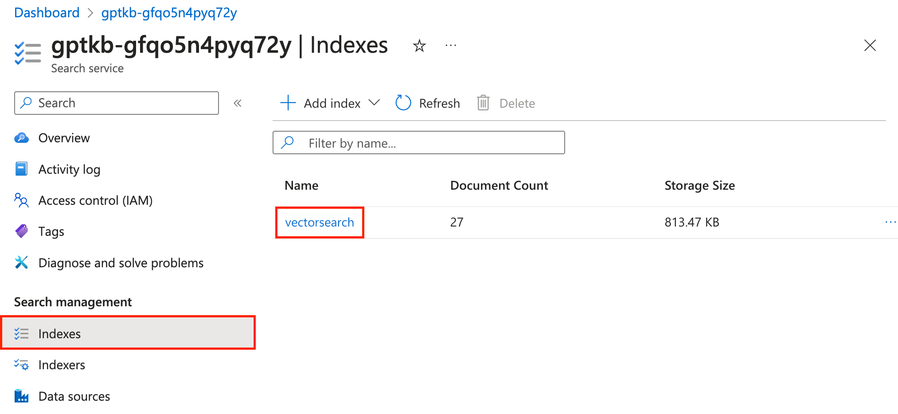
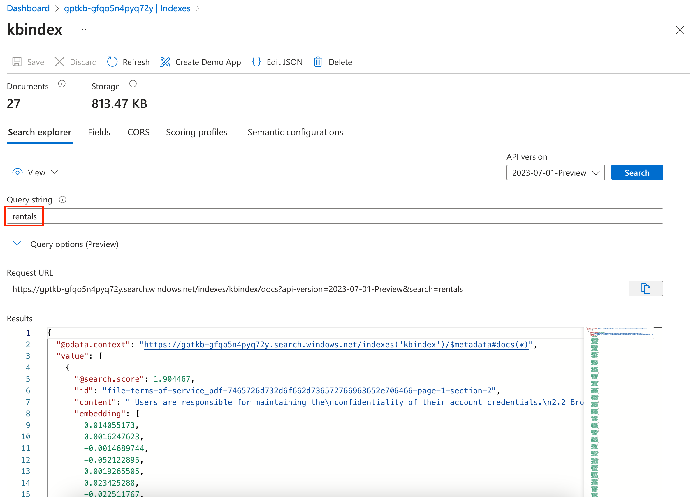

## ベクターデータベース

まず、ベクターデータベースを作成します。ベクターはデータの特徴や特性を表す数値の配列です。例えば、画像はピクセルのベクターに変換でき、単語は意味のベクターに変換できます。ベクターデータベースは、正確な一致ではなく、ベクター間の類似性や距離に基づいて高速かつ正確な検索を行うことができます。これにより、画像認識、自然言語処理、推薦システムなどのアプリケーションが可能になります。

### 取り込みと検索

私たちのユースケースでは、PDFファイルからテキストを抽出し、このテキストを*トークン化*します。トークン化は、テキストを異なるトークンに分割するプロセスであり、これらのトークンは短いテキスト部分になります。これらのトークンは*ベクター*に変換され、データベースに追加されます。ベクターデータベースは、ベクター間の距離に基づいて類似のベクターを検索できます。

これにより、システムは元のPDFファイルから最も関連性の高いデータを見つけることができます。

これは、カスタムChatGPTを構築するために使用するRetrieval Augmented Generation（RAG）パターンの最初のコンポーネント（*Retriever*）で使用されます。

### ベクターデータベースについて

利用可能なベクターデータベースは多数あり、LangChainプロジェクトのサポートされているベクターストアのリストで確認できます：[https://js.langchain.com/docs/integrations/vectorstores/](https://js.langchain.com/docs/integrations/vectorstores/)。

人気のあるものには以下があります：

- [MemoryVectorStore](https://js.langchain.com/docs/integrations/vectorstores/memory)：これはインメモリのベクターストアで、テストや開発には最適ですが、本番環境には適していません。
- [Qdrant](https://qdrant.tech/)
- [pgvector](https://github.com/pgvector/pgvector)
- [Redis](https://redis.io)

Azureでは、上記のベクターデータベースを実行するか、以下のような特定のAzureサービスを使用してこの機能を提供できます：

- [Azure AI Search](https://azure.microsoft.com/services/search/)
- [Azure Cosmos DB for MongoDB vCore](https://learn.microsoft.com/azure/cosmos-db/mongodb/vcore/)

### Azure AI Searchの紹介


[Azure AI Search](https://azure.microsoft.com/products/ai-services/cognitive-search/)は、検索インデックスからベクター埋め込みを保存、インデックス作成、およびクエリを実行できるベクターデータベースとして使用できます。これを使用して、類似性検索、マルチモーダル検索、推薦システム、またはRAGアーキテクチャを実装するアプリケーションを強化できます。

*テキスト、画像、音声、ビデオ、グラフ*などのさまざまなデータタイプをサポートし、正確な一致ではなく、ベクター間の類似性や距離に基づいて高速かつ正確な検索を実行できます。また、同じクエリでセマンティック検索とベクター検索を組み合わせた*ハイブリッド検索*も提供します。

このワークショップでは、Azure AI Searchをベクターデータベースとして使用します。Azure内で簡単に作成および管理できるためです。RAGユースケースでは、ほとんどのベクターデータベースが同様に機能します。

### Azure AI Searchの探索

この時点で、セットアッププロセスで実行した`azd provision`コマンドによって、サブスクリプションにAzure AI Searchサービスが作成されているはずです。

[Azureポータル](https://portal.azure.com/)を開き、トップナビゲーションバーで**AI Search**サービスを検索します。

リストに`gptkb-<your_random_name>`という名前のサービスが表示されるはずです。このインスタンスは現在空であり、次のセクションでインデックスを作成し、データを追加します。




---

## データの取り込み

PDFドキュメントの内容をベクターデータベースに取り込みます。プロジェクトの`src/ingestion`フォルダーにあるツールを使用します。このツールはPDFファイルからテキストを抽出し、ベクターデータベースに送信します。

コードはすでに書かれていますが、その動作を見てみましょう。

### 取り込みプロセス

`src/ingestion/src/plugins/ingestion.ts`ファイルには、ベクターデータベースにデータを取り込むためのコードが含まれています。これはNode.jsアプリケーション内で実行され、Azure Container Appsにデプロイされます。

`data`フォルダーに保存されているPDFファイルは、コマンドラインを使用してこのNode.jsアプリケーションに送信されます。ここで提供されるファイルはデモ目的のみであり、ワークショップの後半で使用する推奨プロンプトはこれらのファイルに基づいています。

<div class="tip" data-title="tip">

> `data`フォルダー内のPDFファイルを独自のPDFファイルに置き換えることもできます。カスタムデータを使用したい場合は、PDFファイルがテキストベースであり、スキャンされた画像ではないことを確認してください。取り込みプロセスには時間がかかる場合があるため、最初はページ数の少ないファイルを少数で開始することをお勧めします。

</div>

#### PDFファイルの内容を読み取る

PDFファイルの内容は、RAGアーキテクチャの*Retriever*コンポーネントの一部として使用され、GPTモデルを使用して質問に対する回答を生成します。

PDFファイルからのテキストは、[pdf.jsライブラリ](https://mozilla.github.io/pdf.js/)を使用して`src/ingestion/src/plugins/ingestion.ts`ファイルで抽出され、LangChain.jsの[PDFファイルローダー](https://js.langchain.com/docs/integrations/document_loaders/file_loaders/pdf/)を介して行われます。テキストが抽出されると、検索結果を改善するために小さなチャンクに分割されます。

```ts
// PDFからテキストを抽出
const blob = new Blob([file.data]);
const loader = new PDFLoader(blob, {
  splitPages: false,
});
const rawDocuments = await loader.load();
rawDocuments[0].metadata.source = file.filename;

// テキストを小さなチャンクに分割
const splitter = new RecursiveCharacterTextSplitter({
  chunkSize: 1500,
  chunkOverlap: 100,
});
const documents = await splitter.splitDocuments(rawDocuments);
```

#### ドキュメントをベクターデータベースに追加

LangChain.jsのベクターストア統合が重い作業を処理します。各ドキュメントについて：
1. 埋め込みが計算されます。
2. 元のテキストと埋め込み（ベクター）を組み合わせた新しいドキュメントが作成されます。
3. ドキュメントが[Azure AI Search JavaScriptクライアントライブラリ](https://www.npmjs.com/package/@azure/search-documents)を使用してベクターデータベースに追加されます。

このプロセスはパフォーマンスを向上させ、リクエストの数を制限するためにバッチ処理されます。

```ts
// 埋め込みを生成し、データベースに保存
await this.vectorStore.addDocuments(documents);
```

### 取り込みプロセスの実行

このプロセスを実行しましょう。まず、取り込みサービスがAzureにデプロイされていることを確認する必要があります。**Azureセットアップ**ステップで忘れた場合は、次のコマンドを実行します：

```bash
azd deploy ingestion
```



取り込みがデプロイされたら、LinuxまたはmacOSでは`./scripts/ingest-data.sh`スクリプトを、Windowsでは`./scripts/ingest-data.ps1`を実行して取り込みプロセスを実行できます：

```bash
./scripts/ingest-data.sh
```



このプロセスが実行されると、Azure AI Searchサービスに新しいインデックスが作成され、取り込まれたドキュメントが表示されます。

### ベクターデータベースのテスト

[Azureポータル](https://portal.azure.com/)で、`gptkb-<your_random_name>`という名前のサービスを再度見つけることができ、`vectorsearch`という新しいインデックスが作成されます。

左側の**検索管理**セクションで、**インデックス**タブを選択します。リストに`vectorsearch`インデックスが表示されるはずです。



そのインデックスを選択して参照できます。例えば、**検索エクスプローラー**タブで、元のPDFファイルが*Contoso Real Estate*会社に関するものであった場合、`rentals`を検索して結果を確認できます：




---